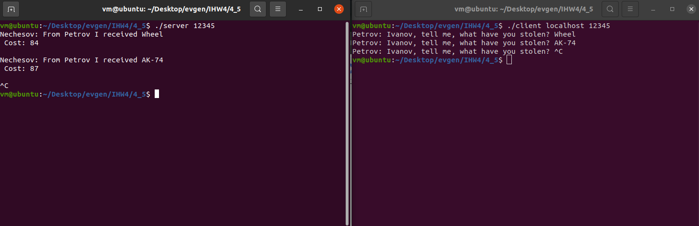
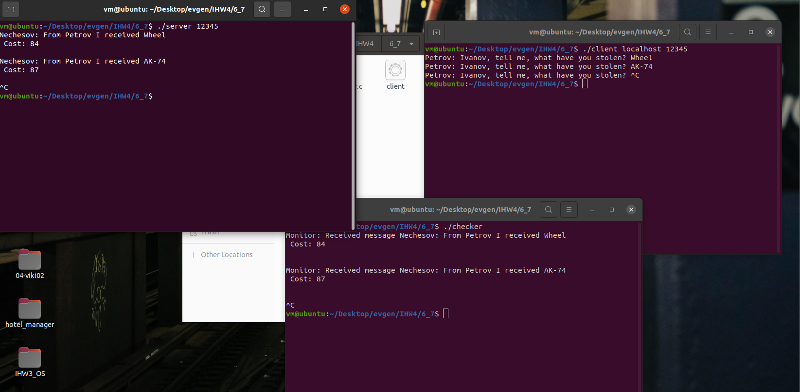

# Операционные системы. ИДЗ №4. Вариант 29.

#### Выполнил Старцев Евгений Борисович, БПИ219.

## Условие

Первая военная задача. Темной–темной ночью прапорщики Иванов, Петров и Нечепорук занимаются хищением военного имущества
со склада родной военной части. Будучи умными людьми и
отличниками боевой и строевой подготовки, прапорщики ввели разделение труда. Иванов выносит имущество со склада и
передает его в руки Петрову, который грузит его в грузовик. Нечепорук стоит на
шухере и заодно подсчитывает рыночную стоимость добычи после погрузки в грузовик очередной партии похищенного. Требуется
создать приложение, моделирующее деятельность прапорщиков. Время выполнения каждого действия прапорщиков - процессов
задавать случайным образом.

## Отчет

Задание выполнено на 6-7 баллов

### Решение на 4-5 баллов.

### Описание работы программы (клиент и сервер)

Программа разделена на две основные части: клиент и сервер. Клиенты (в нашем случае – прапорщики) посылают сообщения на
сервер, и эти сообщения обрабатываются и выводятся на сервере.

Клиент и сервер общаются посредством протокола UDP.

Клиентская программа симулирует деятельность прапорщика Петрова, который грузит вещи в грузовик и сообщает о них
Нечепоруку (серверу). Сервер, в свою очередь, получает эти сообщения и выводит их на экран.

Первая программа представляет собой клиентскую часть. Она устанавливает соединение с сервером и отправляет ему сообщения.

Вначале программа проверяет, было ли в командной строке указано достаточное количество аргументов. Если нет, то программа выводит сообщение об ошибке и завершает свою работу.
После этого программа создает сокет с использованием функции socket().
Затем функция gethostbyname() используется для получения информации о хосте, к которому предполагается подключиться.
Структура sockaddr_in заполняется информацией о сервере, включая его IP-адрес и порт.
В бесконечном цикле программа читает данные от пользователя, добавляет к ним случайное значение стоимости и отправляет их на сервер с помощью функции sendto().

Вторая программа - это серверная часть. Она слушает входящие подключения и выводит полученные от клиента сообщения.

Программа начинает свою работу с проверки аргументов командной строки и создания сокета, как и в клиентской программе.
После этого сервер привязывает сокет к указанному в командной строке порту с помощью функции bind().
Затем создается новый поток, который будет обрабатывать входящие сообщения. Для этого используется функция pthread_create(), которая получает в качестве аргумента функцию handle_client(). Эта функция выполняется в новом потоке и читает входящие сообщения, выводя их на экран.
Основной поток программы ожидает завершения рабочего потока с помощью функции pthread_join(), после чего программа завершает свою работу.
### Инструкция по запуску:

1. Скомпилировать обе программы.

```
// в одном терминале - для компиляции программ
gcc -o server server.c -lrt -pthread
gcc -o client client.c -lrt -pthread
```

2. Запустить сервер

```
./server [port] // порт, который вы хотите использовать для связи
```
3. Запустить клиент

```
./client [hostname] [port]
```
hostname - это имя хоста, на котором запущен ваш сервер, а port - порт, который вы выбрали ранее.

### Демонстрация работы программы:



### Решение на 6-7 баллов.

### Описание работы программы (клиент, сервер и монитор)

Программа расширена дополнительной компонентой - монитором. Эта программа подключается к серверу и слушает сообщения,
которые передаются между клиентом и сервером, отображая их для общего контроля.

Клиент и монитор общаются с сервером по протоколу UDP. Монитор получает как сообщения, отправленные клиентом, так и
ответы сервера.

### Инструкция по запуску:

1. Скомпилировать все программы.

```
// в одном терминале - для компиляции программ
gcc -o server server.c -lrt -pthread
gcc -o client client.c -lrt -pthread
gcc -o checker checker.c -lrt -pthread
```

2. Запустить сервер

```
./server [port] // порт, который вы хотите использовать для связи
```
3. Запустить клиент

```
./client [hostname] [port]
```
hostname - это имя хоста, на котором запущен ваш сервер, а port - порт, который вы выбрали ранее.

4. Запустить сервер

```
./checker [port] // порт, указанный ранее
```

### Демонстрация работы программы:



# The END.

Удачи :)